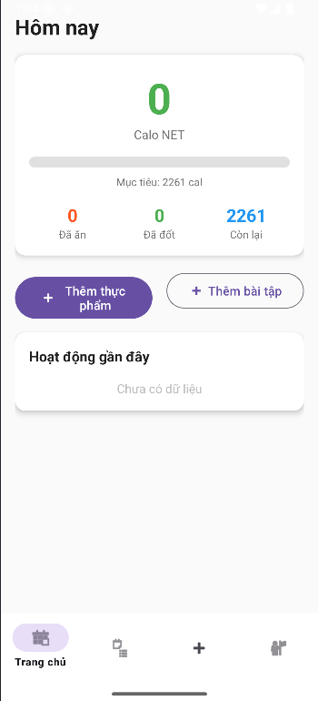
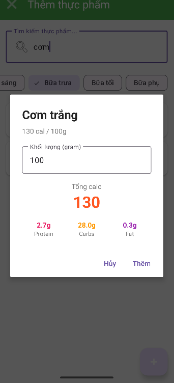
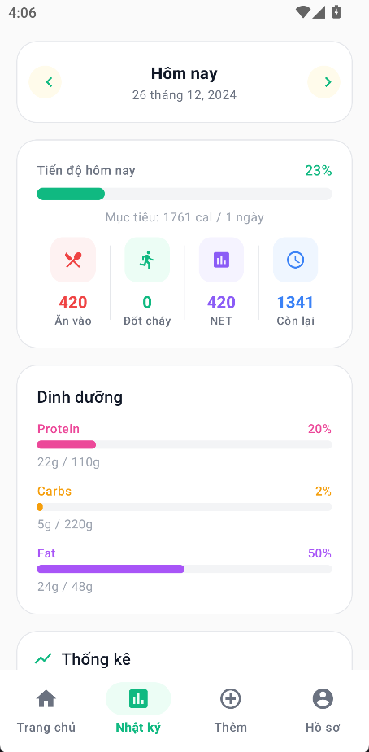

# � TrackingCalloApp

<p align="center">
  
  
  
  
  
</p>

**TrackingCaloApp** là ứng dụng Android giúp theo dõi lượng calo tiêu thụ và đốt cháy hàng ngày. Ứng dụng được thiết kế đặc biệt cho người dùng Việt Nam với cơ sở dữ liệu thực phẩm và bài tập phổ biến, tích hợp API tìm kiếm thực phẩm quốc tế.

## 📱 Screenshots

| Onboarding | Trang chủ | Thêm thực phẩm | Nhật ký |
|:----------:|:---------:|:--------------:|:-------:|
|  |  |  |  |

## ✨ Tính năng

### 🔐 Đăng nhập & Đăng ký
- Hệ thống tài khoản local với mã hóa mật khẩu SHA-256
- Tùy chọn "Ghi nhớ đăng nhập"
- Quản lý phiên đăng nhập

### 🍽️ Theo dõi thực phẩm
- Thêm thực phẩm vào nhật ký theo bữa ăn (sáng, trưa, tối, snack)
- Cơ sở dữ liệu **50+ món ăn Việt Nam** phổ biến
- **Tìm kiếm Hybrid**: Local + FatSecret/USDA API
- Tự tạo thực phẩm tùy chỉnh
- Tự động tính calo, protein, carbs, fat
- Lọc thực phẩm theo loại bữa ăn

### 🏃 Theo dõi bài tập
- Ghi lại các hoạt động thể dục
- Cơ sở dữ liệu **27+ bài tập** phổ biến
- Tự tạo bài tập tùy chỉnh
- Tính calo đốt cháy tự động
- Phân loại: Cardio, Sức mạnh, Linh hoạt

### ⚖️ Theo dõi cân nặng
- Ghi nhận cân nặng hàng ngày
- Biểu đồ xu hướng cân nặng (LineChart)
- Đặt mục tiêu cân nặng cụ thể
- Tính toán thời gian đạt mục tiêu
- Cảnh báo tốc độ giảm/tăng cân an toàn

### 📊 Tính toán thông minh
- Tính **BMR** (Basal Metabolic Rate) theo công thức Mifflin-St Jeor
- Tính **TDEE** (Total Daily Energy Expenditure)
- Tính **BMI** (Body Mass Index) theo chuẩn châu Á
- Mục tiêu calo tùy chỉnh theo mục đích (giảm/giữ/tăng cân)
- Tính toán mục tiêu calo dựa trên cân nặng mục tiêu

### 📈 Biểu đồ thống kê (MPAndroidChart)
- **LineChart**: Xu hướng calo theo ngày/tuần/tháng
- **BarChart**: So sánh calo theo bữa ăn
- **PieChart**: Phân bố macro (Protein, Carbs, Fat)
- Chuyển đổi khoảng thời gian: 7 ngày, 30 ngày, 90 ngày

### 📅 Nhật ký chi tiết
- Xem lịch sử theo ngày
- Tổng hợp calo tiêu thụ và đốt cháy
- Theo dõi tiến độ với progress bar (hỗ trợ overflow)
- Phân tích dinh dưỡng (protein, carbs, fat)

## 🛠️ Công nghệ sử dụng

| Công nghệ | Mô tả |
|-----------|-------|
| **Java 11** | Ngôn ngữ lập trình chính |
| **Room Database** | Local database với SQLite (v4, 6 entities) |
| **LiveData** | Reactive data holder |
| **ViewModel** | UI-related data holder |
| **Material Design 3** | Modern UI components |
| **ViewPager2** | Swipeable views |
| **RecyclerView** | Efficient list display |
| **MPAndroidChart** | Biểu đồ thống kê (Line, Bar, Pie) |
| **Volley** | HTTP client cho API calls |
| **FatSecret/USDA API** | Tìm kiếm thực phẩm online |

## 📁 Cấu trúc Project

```
app/src/main/java/com/example/trackingcaloapp/
│
├── 📁 data/                          # Data layer
│   ├── 📁 local/
│   │   ├── 📁 database/
│   │   │   └── AppDatabase.java      # Room database singleton (v4)
│   │   ├── 📁 dao/
│   │   │   ├── FoodDao.java          # Food data access
│   │   │   ├── FoodEntryDao.java     # Food entry data access
│   │   │   ├── WorkoutDao.java       # Workout data access
│   │   │   ├── WorkoutEntryDao.java  # Workout entry data access
│   │   │   ├── WeightLogDao.java     # Weight log data access
│   │   │   └── UserDao.java          # User authentication data access
│   │   └── 📁 entity/
│   │       ├── Food.java             # Food entity (+ API fields)
│   │       ├── FoodEntry.java        # Food diary entry
│   │       ├── Workout.java          # Workout entity
│   │       ├── WorkoutEntry.java     # Workout diary entry
│   │       ├── WeightLog.java        # Weight tracking entry
│   │       └── User.java             # User account entity
│   ├── 📁 api/
│   │   ├── FatSecretApiService.java  # FatSecret API integration
│   │   └── UsdaApiService.java       # USDA FoodData Central API
│   ├── 📁 preferences/
│   │   └── UserPreferences.java      # SharedPreferences wrapper
│   └── 📁 repository/
│       ├── FoodRepository.java       # Food data repository (+ API search)
│       ├── FoodEntryRepository.java  # Food entry repository
│       ├── WorkoutRepository.java    # Workout data repository
│       ├── WorkoutEntryRepository.java
│       ├── WeightLogRepository.java  # Weight log repository
│       └── UserRepository.java       # User authentication repository
│
├── 📁 model/                         # Data models
│   ├── DailySummary.java             # Daily summary model
│   ├── DailyCalorieSum.java          # Daily calorie aggregation
│   ├── MacroSum.java                 # Macro nutrients sum
│   ├── MealTypeCalories.java         # Calories by meal type
│   ├── HourlyCalorieSum.java         # Hourly calorie aggregation
│   ├── FoodEntryWithFood.java        # Food with entry wrapper
│   ├── WorkoutEntryWithWorkout.java  # Workout with entry wrapper
│   ├── UserInfo.java                 # User profile info model
│   └── ValidationResult.java         # Form validation result
│
├── 📁 ui/                            # UI layer (Single Activity + Fragments)
│   ├── 📁 login/
│   │   ├── LoginActivity.java        # Login screen
│   │   └── RegisterActivity.java     # Registration screen
│   ├── 📁 main/
│   │   ├── MainActivity.java         # Container chính + Bottom Navigation
│   │   └── RecentActivityAdapter.java
│   ├── 📁 onboarding/
│   │   └── OnboardingActivity.java   # First-time setup (+ target weight)
│   ├── 📁 home/
│   │   └── HomeFragment.java         # Dashboard với charts
│   ├── 📁 add/
│   │   ├── AddFragment.java          # Container với ViewPager2
│   │   ├── AddPagerAdapter.java      # Adapter cho tabs Food/Workout
│   │   ├── AddFoodFragment.java      # Thêm thực phẩm (+ API search)
│   │   ├── AddWorkoutFragment.java   # Thêm bài tập
│   │   ├── FoodAdapter.java
│   │   └── WorkoutAdapter.java
│   ├── 📁 diary/
│   │   ├── DiaryFragment.java        # Nhật ký với charts
│   │   ├── DiaryFragmentPagerAdapter.java
│   │   ├── FoodEntriesFragment.java
│   │   ├── FoodEntryAdapter.java
│   │   ├── WorkoutEntriesFragment.java
│   │   └── WorkoutEntryAdapter.java
│   ├── 📁 profile/
│   │   ├── ProfileFragment.java      # Profile với weight chart
│   │   ├── ProfileViewModel.java     # Profile ViewModel
│   │   └── QuickWeightLogDialogFragment.java
│   └── 📁 view/
│       └── OverflowProgressBar.java  # Custom progress bar
│
└── 📁 utils/                         # Utilities
    ├── CalorieCalculator.java        # Calorie calculations (+ target weight)
    ├── ChartHelper.java              # MPAndroidChart helper
    ├── Constants.java                # App constants
    ├── DateUtils.java                # Date utilities
    └── PasswordUtils.java            # Password hashing (SHA-256)
```

**Kiến trúc**: Single Activity (MainActivity) + Multiple Fragments, điều hướng qua Bottom Navigation Bar.

## 🚀 Cài đặt

### Yêu cầu
- Android Studio Hedgehog (2023.1.1) trở lên
- JDK 11 trở lên
- Android SDK 27+ (Android 8.1)
- Gradle 8.0+

### Các bước cài đặt

1. **Clone repository**
```bash
git clone https://github.com/Anroiy123/TrackingCaloApp.git
cd TrackingCaloApp
```

2. **Cấu hình API Keys** (tùy chọn - cho tìm kiếm online)
```properties
# local.properties
FATSECRET_CLIENT_ID=your_client_id
FATSECRET_CLIENT_SECRET=your_client_secret
```

3. **Mở project trong Android Studio**
```
File → Open → Chọn thư mục TrackingCaloApp
```

4. **Sync Gradle**
```
Android Studio sẽ tự động sync, hoặc click "Sync Now"
```

5. **Build và chạy**
```
Click Run (▶️) hoặc Shift+F10
```

## 📖 Hướng dẫn sử dụng

### 1. Đăng ký / Đăng nhập
- Tạo tài khoản mới với username và password
- Đăng nhập với tùy chọn "Ghi nhớ đăng nhập"
- Mật khẩu được mã hóa SHA-256

### 2. Thiết lập ban đầu (Onboarding)
- Nhập thông tin cá nhân: tên, tuổi, chiều cao, cân nặng
- Chọn giới tính
- Chọn mức độ hoạt động
- Chọn mục tiêu (giảm/giữ/tăng cân)
- **Mới**: Đặt cân nặng mục tiêu và tốc độ thay đổi (kg/tuần)
- App sẽ tự động tính mục tiêu calo hàng ngày

### 3. Thêm thực phẩm
- Từ trang chủ, nhấn tab "Add" ở bottom navigation
- Chọn tab "Thực phẩm" trong màn hình Add
- Tìm kiếm từ database local hoặc online (FatSecret/USDA)
- Nhập khối lượng (gram)
- Chọn bữa ăn
- Nhấn "Thêm"
- **Mới**: Tự tạo thực phẩm tùy chỉnh

### 4. Thêm bài tập
- Từ trang chủ, nhấn tab "Add" ở bottom navigation
- Chọn tab "Bài tập" trong màn hình Add
- Chọn loại bài tập
- Nhập thời gian/khoảng cách
- Nhấn "Thêm"
- **Mới**: Tự tạo bài tập tùy chỉnh

### 5. Xem nhật ký
- Nhấn vào tab "Diary" ở bottom navigation
- Chuyển ngày bằng nút prev/next
- Chuyển tab Food/Workout để xem chi tiết
- **Mới**: Xem biểu đồ thống kê (Bar, Pie, Line)

### 6. Theo dõi cân nặng
- Vào tab "Profile"
- Nhấn nút FAB để ghi nhận cân nặng
- Xem biểu đồ xu hướng cân nặng
- Theo dõi tiến độ đạt mục tiêu

## 🧮 Công thức tính toán

### BMR (Basal Metabolic Rate)
Sử dụng công thức **Mifflin-St Jeor**:

```
Nam:   BMR = (10 × weight) + (6.25 × height) - (5 × age) + 5
Nữ:    BMR = (10 × weight) + (6.25 × height) - (5 × age) - 161
```

### TDEE (Total Daily Energy Expenditure)
```
TDEE = BMR × Activity Multiplier

Activity Multipliers:
- Ít vận động:        1.2
- Vận động nhẹ:       1.375
- Vận động vừa:       1.55
- Vận động nhiều:     1.725
- Vận động rất nhiều: 1.9
```

### Mục tiêu calo
```
Giảm cân:  TDEE - 500 cal/ngày (giảm ~0.5kg/tuần)
Giữ cân:   TDEE
Tăng cân:  TDEE + 500 cal/ngày (tăng ~0.5kg/tuần)
```

### Calo NET
```
Calo NET = Calo tiêu thụ (ăn) - Calo đốt cháy (tập)
Còn lại = Mục tiêu - Calo NET
```

## 🗄️ Database Schema (v4)

### Foods Table
| Column | Type | Description |
|--------|------|-------------|
| id | INTEGER | Primary key |
| name | TEXT | Tên thực phẩm |
| calories | REAL | Calo/100g |
| protein | REAL | Protein/100g |
| carbs | REAL | Carbs/100g |
| fat | REAL | Fat/100g |
| category | TEXT | Danh mục |
| isCustom | INTEGER | User tạo? |
| apiId | INTEGER | FatSecret food_id (nullable) |
| apiSource | TEXT | "fatsecret" hoặc null |
| cachedAt | INTEGER | Timestamp cache từ API |

### Food Entries Table
| Column | Type | Description |
|--------|------|-------------|
| id | INTEGER | Primary key |
| foodId | INTEGER | FK → Foods |
| quantity | REAL | Khối lượng (g) |
| mealType | INTEGER | 0-3 (bữa ăn) |
| date | INTEGER | Timestamp |
| totalCalories | REAL | Calo đã tính |
| totalProtein | REAL | Protein đã tính |
| totalCarbs | REAL | Carbs đã tính |
| totalFat | REAL | Fat đã tính |

### Workouts Table
| Column | Type | Description |
|--------|------|-------------|
| id | INTEGER | Primary key |
| name | TEXT | Tên bài tập |
| caloriesPerUnit | REAL | Calo/đơn vị |
| unit | TEXT | Đơn vị (phút/km) |
| category | TEXT | Loại bài tập |
| isCustom | INTEGER | User tạo? |

### Workout Entries Table
| Column | Type | Description |
|--------|------|-------------|
| id | INTEGER | Primary key |
| workoutId | INTEGER | FK → Workouts |
| quantity | REAL | Số lượng |
| duration | INTEGER | Thời gian (phút) |
| date | INTEGER | Timestamp |
| caloriesBurned | REAL | Calo đốt cháy |
| note | TEXT | Ghi chú |

### Weight Logs Table (Mới)
| Column | Type | Description |
|--------|------|-------------|
| id | INTEGER | Primary key |
| weight | REAL | Cân nặng (kg) |
| timestamp | INTEGER | Thời điểm ghi nhận |
| note | TEXT | Ghi chú (nullable) |

### Users Table (Mới)
| Column | Type | Description |
|--------|------|-------------|
| id | INTEGER | Primary key |
| username | TEXT | Tên đăng nhập (unique) |
| passwordHash | TEXT | Mật khẩu đã hash (SHA-256) |
| createdAt | INTEGER | Thời điểm tạo tài khoản |

## 🤝 Đóng góp

Mọi đóng góp đều được chào đón! Vui lòng:

1. Fork repository
2. Tạo branch mới (`git checkout -b feature/AmazingFeature`)
3. Commit changes (`git commit -m 'Add some AmazingFeature'`)
4. Push to branch (`git push origin feature/AmazingFeature`)
5. Mở Pull Request

## 📝 License

Distributed under the MIT License. See `LICENSE` for more information.

## 👨‍💻 Tác giả

**Anroiy123**
- GitHub: [@Anroiy123](https://github.com/Anroiy123)

## 🙏 Acknowledgments

- [Material Design](https://material.io/)
- [Android Jetpack](https://developer.android.com/jetpack)
- [Room Persistence Library](https://developer.android.com/training/data-storage/room)
- [MPAndroidChart](https://github.com/PhilJay/MPAndroidChart)
- [FatSecret Platform API](https://platform.fatsecret.com/)
- [USDA FoodData Central](https://fdc.nal.usda.gov/)

